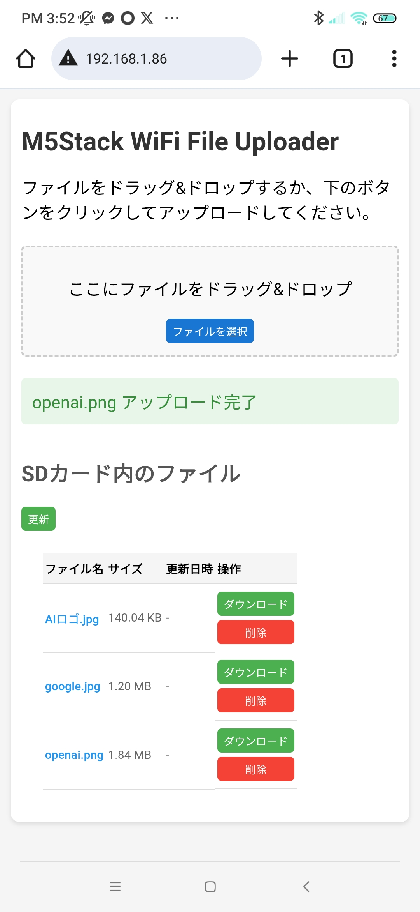
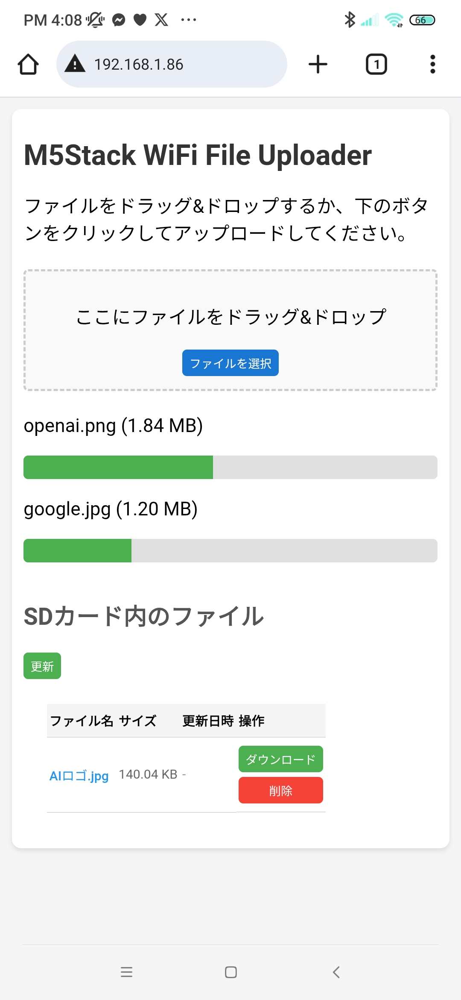

# M5Stack WiFi Uploader - Sample Code

This directory contains usage examples and test code for the M5Stack WiFi Uploader library.

## Sample List

### Basic Samples

#### 1. HTTPUploadExample



**File**: `HTTPUploadExample/HTTPUploadExample.ino`

**Description**: Basic HTTP upload usage example. Connects to WiFi router, starts HTTP server, and uploads files.

**Main Features**:
- WiFi station connection
- HTTP server startup
- Basic callback settings
- Log output to serial monitor

**Recommended**: Start with this sample if you're using it for the first time.

---

#### 2. MultiFileUploadExample



**File**: `MultiFileUploadExample/MultiFileUploadExample.ino`

**Description**: Sample supporting simultaneous upload of multiple files.

**Main Features**:
- Simultaneous upload of multiple files
- Progress display
- File list display
- File deletion function

---

#### 3. WebSocketUploadExample

**File**: `WebSocketUploadExample/WebSocketUploadExample.ino`

**Description**: Sample of high-speed upload using WebSocket protocol.

**Main Features**:
- WebSocket server startup
- Real-time progress notification
- Binary frame processing
- High-speed transfer

**Recommended**: Use when large files or high-speed transfer is required.

---

#### 4. APModeExample

**File**: `APModeExample/APModeExample.ino`

**Description**: Sample for operating M5Stack as WiFi Access Point (AP). Files can be uploaded without connecting to external WiFi router.

**Main Features**:
- WiFi AP mode
- Fixed IP address (192.168.4.1)
- Connected client count display
- Status display on M5Stack screen

**How to Use**:
1. Start M5Stack
2. Connect to "M5Stack-AP" in PC/smartphone WiFi settings
3. Password: "12345678"
4. Access http://192.168.4.1 in browser

**Recommended**: Optimal for environments without WiFi router or when using M5Stack as independent access point.

---

#### 5. FullFeaturedDemo

**File**: `FullFeaturedDemo/FullFeaturedDemo.ino`

**Description**: Complete demo application integrating all library features.

**Main Features**:
- Complete status display on M5Stack screen
- Button operations (file list, status, clear)
- Real-time progress bar
- Error display
- Statistics display

**Recommended**: Use when checking all library features or as reference for actual application development.

---

#### 6. FileDownloadExample

**File**: `FileDownloadExample/FileDownloadExample.ino`

**Description**: Sample of downloading files from SD card via Web UI.

**Main Features**:
- File list display
- File download
- File deletion

---

### Test Code

Test code is stored in `tests/` folder. Can be used to verify operation of each library component.

#### 1. test_error_handler

**File**: `tests/test_error_handler/test_error_handler.ino`

**Description**: Function test of ErrorHandler class.

**Test Contents**:
- Error log recording
- Error history retrieval
- Recoverable error determination
- Error statistics
- Error callback

---

#### 2. test_progress_tracker

**File**: `tests/test_progress_tracker/test_progress_tracker.ino`

**Description**: Function test of ProgressTracker class.

**Test Contents**:
- Progress tracking
- Transfer speed calculation
- Remaining time calculation
- Multiple file progress management
- Format functions
- Pause/resume

---

#### 3. test_integration

**File**: `tests/test_integration/test_integration.ino`

**Description**: Integration test of M5StackWiFiUploader library.

**Test Contents**:
- Initialization test
- Settings test
- Callback test
- SD card operation test
- Status retrieval test

---

## How to Use

1. Open each sample folder in Arduino IDE.
2. Change WiFi settings (SSID, password) to match your environment.
3. Upload to M5Stack.
4. Check IP address in serial monitor.
5. Access that IP address in browser.

## How to Change Allowed Extensions (Transferable Files)

This library validates the file extension on upload.
You can override the allowed extensions from your sketch by calling `setAllowedExtensions()`.

### Steps (Recommended)

1. Prepare a list of allowed extensions (without dot).
2. Call `setAllowedExtensions()` after `begin()`.

```cpp
const char* allowedExtensions[] = {
  "bin",
  "txt",
  "json",
};

uploader.setAllowedExtensions(
  allowedExtensions,
  sizeof(allowedExtensions) / sizeof(allowedExtensions[0])
);
```

### Notes

- Specify extensions **without a dot** (e.g. `"bin"`).
- **Lowercase is recommended** (the library converts the uploaded file's extension to lowercase before comparing).
- If the allow list is empty (`count == 0`), the extension check always fails and uploads will be rejected.
- Currently, **the download feature is not restricted by extension** (it only checks for path traversal, etc.).

### Default Allowed Extensions

If you do not change the setting, the following extensions are allowed by default.

- `jpg`, `jpeg`, `png`, `gif`, `bmp`
- `bin`, `dat`, `txt`, `csv`, `json`
- `zip`, `rar`, `7z`, `tar`, `gz`

## Troubleshooting

If problems occur, please refer to the [Troubleshooting Guide](../docs/TROUBLESHOOTING.md).
